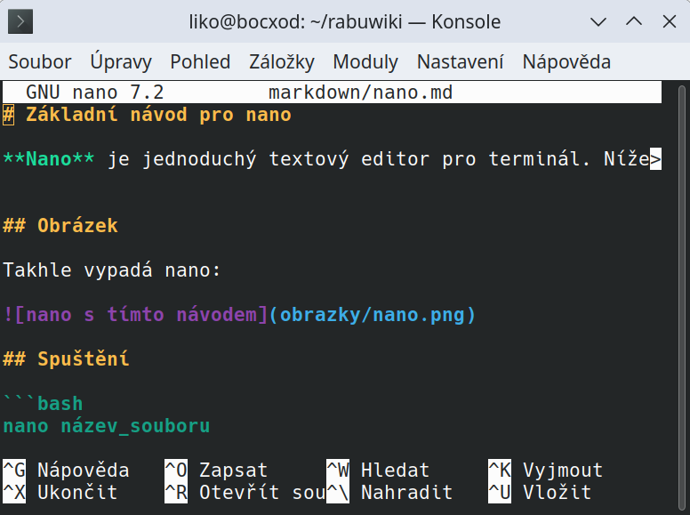

# Základní návod pro nano

**Nano** je jednoduchý textový editor pro terminál. Níže jsou uvedeny základní příkazy, které ti pomohou začít.


## Obrázek

Takhle vypadá nano:



## Spuštění

```bash
nano název_souboru

Pohyb v souboru
Šipky: Pohyb kurzorem

Ctrl + _ + číslo řádku: Přejít na konkrétní řádek

Úpravy
Piš text běžně jako v jiném editoru

Backspace nebo Delete: mazání znaků

Uložení a ukončení
Ctrl + O: Uložit soubor (potvrď název Enterem)

Ctrl + X: Ukončit editor (pokud jsou neuložené změny, editor se zeptá)

Užitočné příkazy

| Klávesová zkratka | Akce                         |
| ----------------- | ---------------------------- |
| `Ctrl` + `G`      | Nápověda                     |
| `Ctrl` + `W`      | Hledat v souboru             |
| `Ctrl` + `K`      | Vyjmout řádek                |
| `Ctrl` + `U`      | Vložit řádek                 |
| `Ctrl` + `\`      | Nahradit (hledat a nahradit) |
| `Ctrl` + `C`      | Zobrazit pozici kurzoru      |

Tipy
Nano automaticky nevytváří zálohy – ulož si práci často!

Při chybě použij Ctrl + C k přerušení příkazu nebo návratu

Editor nano je vhodný pro začátečníky i pokročilé, kteří potřebují rychlé úpravy přímo v terminálu.

# 🅰️ Nano – legenda Meta (`M-`) příkazů (Alt + …)

V editoru **nano** znamená `M-` klávesovou zkratku s **Alt** (tzv. „Meta“ klávesou). Níže jsou nejčastější z nich – i s popisem v češtině.

| Zkratka (M-…)   | Klávesa             | Význam (česky)                          |
|-----------------|---------------------|------------------------------------------|
| `M-U`           | `Alt + U`           | Vrátit poslední akci (Undo)             |
| `M-E`           | `Alt + E`           | Přejít na konec slova                   |
| `M-B`           | `Alt + B`           | Přejít na začátek slova                 |
| `M-6`           | `Alt + 6`           | Kopírovat aktuální řádek (označení)     |
| `M-]`           | `Alt + ]`           | Skok na konec bloku závorek             |
| `M-[`           | `Alt + [`           | Skok na začátek bloku závorek           |
| `M-A`           | `Alt + A`           | Spustit/ukončit označování (markování)  |
| `M-Y`           | `Alt + Y`           | Přejít na začátek souboru               |
| `M-\\`          | `Alt + \\`          | Přejít na začátek                        |
| `M-/`           | `Alt + /`           | Přejít na konec souboru                 |
| `M-T`           | `Alt + T`           | Kontrola pravopisu (pokud je podpora)   |
| `M-V`           | `Alt + V`           | Posun o stránku dolů (někdy `PgDn`)     |
| `M-^`           | `Alt + Shift + 6`   | Začít označování (jiná varianta `M-A`)  |
| `M-Q`           | `Alt + Q`           | Přeskočit zpět na předchozí výskyt      |
| `M-G`           | `Alt + G`           | Přejít na konkrétní řádek               |
| `M-R`           | `Alt + R`           | Vložit obsah jiného souboru             |
| `M-C`           | `Alt + C`           | Zobrazit/skrýt počítadlo znaků a řádků  |

> 📝 Některé zkratky se liší podle nastavení systému nebo klávesnice – pokud ti některé nefungují, zkus jiný terminál (např. `xterm` nebo `gnome-terminal`).

---

## 🧪 Tip: Jak poznáš aktivní označení

Když zmáčkneš `Alt + A`, aktivuje se označování. Pomocí šipek označíš blok textu a pak:

- `Ctrl + K` = vyjmeš (odstraníš) označený blok
- `Alt + 6` = zkopíruješ blok
- `Ctrl + U` = vložíš blok

---

^ = Ctrl
M- = Alt (Meta)

🧪 Tip pro otestování:
Pokud si nejsi jistý, co zkratka dělá, klidně si otevři testovací soubor a vyzkoušej např.:

Alt + U → vrátí poslední změnu
Alt + E → pohyb na konec řádku/slova
Alt + A → označování textu (začne výběr)

