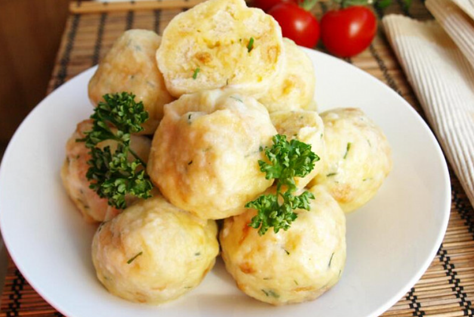

# Recept: Maminčiny vídeňské knedlíčky v konvektomatu

## Úvod  
Tento rodinný recept na vídeňské knedlíčky je osvědčený a lahodný. Díky použití konvektomatu dosáhnete dokonale nadýchané konzistence a rovnoměrného propečení. Skvěle se hodí jako příloha k dušenému masu nebo omáčkám.

---

## Ingredience (na cca 12 knedlíčků)

- 500 g rohlíků nebo bílého pečiva (nejlépe den starého)  
- 250 ml mléka  
- 3 vejce  
- 1 malá cibule (nadrobno)  
- Hrst nasekané petrželky  
- 1 lžíce másla  
- Sůl, pepř  
- (volitelné) špetka muškátového oříšku  

📷 **Ilustrační foto:**  

---

## Postup

### 1. Příprava těsta  
- Pečivo nakrájejte na malé kostičky a dejte do velké mísy.  
- V pánvi osmahněte cibulku na másle dozlatova.  
- V míse vyšlehejte vejce s mlékem, solí, pepřem a muškátovým oříškem.  
- Směs nalijte na pečivo, přidejte cibulku a nasekanou petržel.  
- Jemně promíchejte a nechte 10–15 minut odležet, dokud pečivo nenabobtná.  

---

### 2. Tvarování a napařování v konvektomatu  
- Z navlhčených rukou tvořte kulaté knedlíčky o velikosti pingpongového míčku.  
- Položte je na napařovací rošt nebo děrovaný GN plech.  
- V konvektomatu nastavte program:  
  - **100 °C – pára (steam)**  
  - **Doba: 20 minut**  

---

### 3. Servírování  
- Po uvaření nechte knedlíčky chvíli odpočinout.  
- Podávejte teplé, ideálně s hovězím na smetaně nebo gulášem.  

---

## Tipy a poznámky  
- Pokud nemáte konvektomat, můžete použít napařovací hrnec.  
- Přidáním slaniny nebo uzeného masa do těsta získáte variantu "na špeku".  
- Knedlíčky lze připravit předem a znovu ohřát v páře.  

---

## Závěr  
Vídeňské knedlíčky z konvektomatu jsou nadýchané, lehké a skvěle doplňují tradiční českou kuchyni. Tento recept je osvědčený rodinný poklad — a díky moderní přípravě i bez námahy.

Dobrou chuť! 🍽️

PŮVODNÍ recept ze kterého jsme vycházeli:

# Kynuté maminčiny vídeňské knedlíky ala Pelíšky 🍞🥟

## Suroviny

- 4 špetky soli 🧂  
- 4 špetky cukru 🍬 
- 500 g mouky (hladká, hrubá, polohrubá, nebo mix – na tom až tak nezáleží) 🌾  
- 1 vejce 🥚  
- 250 ml vlažného mléka 🥛  
- ½ kostky droždí (asi 21 g) 🍃 
- 1 rohlík (asi 3 dny starý) 🥖

## Postup

1. Mouku nasypeme do mísy, přidáme sůl a promícháme.  
2. Uprostřed uděláme důlek, do kterého vyklepneme vejce.  
3. Na vejce rozdrobíme droždí, posypeme cukrem a přilijeme trochu vlažného mléka.  
4. Vše lehce prošleháme vidličkou a necháme cca 5 minut odpočívat, aby se začal „kvásek“.  
5. Postupně přiléváme zbytek mléka a stále mícháme vidličkou, dokud se nezačne tvořit těsto.  
6. Jakmile máme těsto promíchané, začneme ho rukama důkladně hníst, dokud není hladké, vláčné a nelepí se.  
7. Do těsta zapracujeme na kostičky nakrájený rohlík.  
8. Mísu přikryjeme čistou utěrkou a necháme těsto kynout 30 minut na teplém místě (např. na radiátoru).  
9. Po vykynutí vytvarujeme z těsta menší šišky nebo kuličky – vyjde přibližně 21 kusů velikosti „akorát do huby“.  
10. Knedlíky naskládáme na tři patra do parního hrnce.  
11. Parníme přibližně 20–30 minut podle velikosti, dokud nejsou krásně nadýchané a hotové.

## Tipy

- Pokud nemáš parní hrnec, můžeš použít pařák nebo napařovací nástavec do hrnce.  
- Hodí se jako příloha k omáčkám, dušenému masu, nebo jen tak s máslem a cukrem.  
- Zkušení kuchaři doporučují, aby rohlík byl opravdu starší – lépe vsákne vlhkost a knedlík nebude mokrý uvnitř.  
- Dbej na to, aby těsto nebylo příliš mokré – lepivost je dobré řešit přidáním mouky nebo krátkým posypem těsta při hnětení.

---

**Navržená citace:**

Autor neznámý, *Kynuté maminčiny vídeňské knedlíky ala Pelíšky*, kuchařský recept, [online dok.: soukromá rodinná kuchařka] (cit. 2025).

